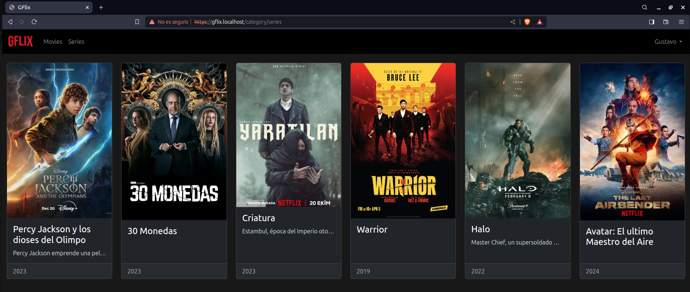

# Gflix
Netflix clone Site based in Laravel


## Technologies
* PHP 8.2
* Laravel 10
* Twitter bootstrap
* Postgres
* [OpenAdmin](https://github.com/open-admin-org/open-admin) 

## Setup
Construct docker image
```terminal
docker build -t gflix .
```
Run and access to php machine
```terminal
docker run -p 80:80 -p 443:443 --name gflix -it gflix /bin/bash
```

### For local development
Docker-compose
```terminal
docker-compose build
docker-compose up -d
```

## Utils
Online Subtitle format converter from .srt -> .vtt
https://www.happyscribe.com/subtitle-tools/convert-srt-to-vtt

Covert subtitle with ffmpeg
```terminal
ffmpeg -i halo_s01e05.srt halo_s01e05.vtt
```

Convert video format
```terminal
ffmpeg -i halo_s01e05.avi halo_s01e05.mp4
```

Extract poster from video frame
```terminal
ffmpeg -ss 00:04:12 -i wednesday.s01e01.mp4 -vframes 1 -q:v 2 screenshot.png
```

### Fixing video encoding issues
Download **HandBrake** https://handbrake.fr
Important: Check web optimized

## Create Self-Signed SSL Certificate
```bash
sudo openssl req -x509 -nodes -days 365 -newkey rsa:2048 -keyout ./etc/ssl/private/gflix.key -out ./etc/ssl/certs/gflix.crt
```

## Admin
### Create user
```bash
php artisan admin:create-user
```

## Backup a PostgreSQL database
```bash
pg_dump -U postgres -d gflix > gflix.sql
```

### Install postgres client
```bash
sudo apt-get install postgresql-client
```
